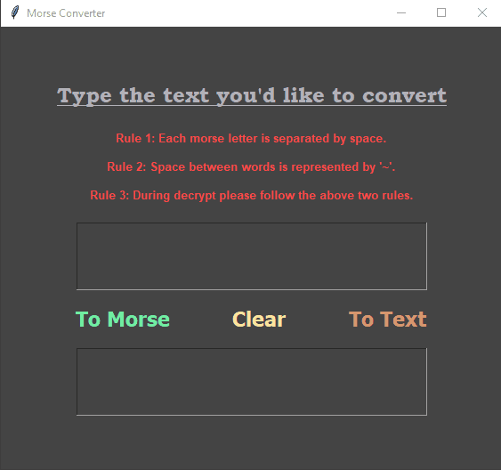

# MorseCodeConverter 🔐
A Text to Morse to Text Convertor

### Written in python 3.9 

## Installation on Windows:
* `git clone https://github.com/snehangsude/MorseCodeConverter.git`
* `cd MorseCodeConverter`
* `python main.py`

## Installation on Linux and Unix like OS:
* `git clone https://github.com/snehangsude/MorseCodeConverter.git`
* `cd MorseCodeConverter`
* `python3 main.py`

## Interface GIF
* Inital screen

## How to use

* Run the application using the Installation section
* Enter the Text on the top box and select "To Morse" to convert to Morse code
* Enter the Morse ont the top box and select "To Text" to conver to Text
* Try to clear after every use (the header would prompt) to avoid clogging the output box
* <b>Hint:</b> Contains all usable text, numbers and punctuations. Check the `data.py` file for details.

## Rules
* Each letter is separated by a manual space <b>Eg:</b> "SOS" will be "... --- ..."
* Each word is separated by '~' <b>Eg:</b> "HELLO WORLD" will be ....(H) .(E) .-..(L) .-..(L) ---(O) ~(space) .--(W) ---(O) .-.(R) .-..(L) -..(D)
* When converting from Morse to Text, follow the above rules, separate words by '~' and letters by manual space

### Improvements planned

* Plans to integrate sound
